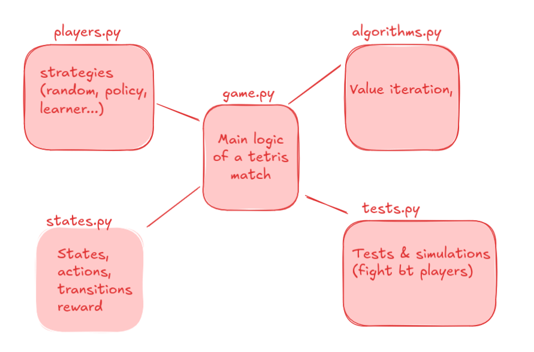

# BabyTetris
Project Optimization under uncertainty

## I) Project Architecture:

## II) Guide to navigating the project

**game.py**:
Location of the Game object representing a Tetris game; the `play()` method simulates an entire game.

**states.py**:
Modeling of objects used in the Tetris game: `Piece`, `PlayerAction`, `SelectorAction`, `State`.
Note that in our model, a state is a grid of Booleans with `True` if the space is available and `False` otherwise (the space is taken by a piece). 
Attention point: In the code, the state object corresponds to the grid, and the state in the MDP modeling is a grid with an incoming piece.

**players.py**:
A player is someone who, given an incoming piece, performs an action that corresponds to choosing an abscissa and a number of rotations according to a certain policy. One player = one policy.
Also, we have implemented a `Selector` object responsible for choosing which piece comes into the game, so since the beginning we model the game as a duel between a `Player` and a `Selector` (which plays randomly in the first part of the project).

**algorithm.py**:
Where the value iteration is calculated and then stored in a JSON file as a dictionary that associates a state and an incoming piece with a player action. The `ValueIterationPlayer` will then use this dictionary to play (named `cheat_dict`).

**tests.py**:
File to launch a simulation of a Tetris game. Use `pytest tests.py -s` in a terminal to launch it.
To test with different lambda you need to modify the `cheatdict_name` to have the correct corresponding path (all the JSON files are in the `cheatdict` folder).
